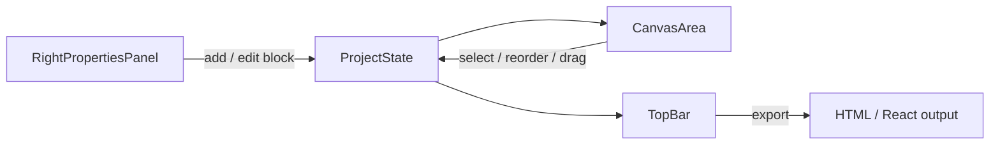

<div align="center">


<br/>


</div>

---

## ✨ What is Landy?

**Landy** is a visual, drag-and-drop landing page builder. Add sections, edit content inline, restyle everything from a live properties panel, preview across devices, and export clean **HTML + Tailwind** or a **React/TypeScript** component — no code editor required.

<div align="center">

</div>

## 🚀 Features

| | |
|---|---|
| 🧩 **17+ block types** | Navbar, Hero, Stats, Features, Testimonials, Pricing, FAQ, Team, Contact Form, Video, and more |
| 🎨 **4 built-in themes** | Minimal Modern, Frosted Glass, Neo-Brutalist, Cosmic Dark |
| 🖱️ **Live canvas editing** | Click-to-edit text, drag-to-reorder, floating block toolbar, real-time dimension overlay |
| 📱 **Responsive preview** | Desktop, laptop, tablet, and mobile viewports with zoom control |
| 🖼️ **Built-in stock photos** | Curated Unsplash categories, plus direct upload or URL |
| 🎬 **Smart video embeds** | Paste a YouTube / Vimeo / Loom link — auto-converts to embed |
| ↩️ **Undo / redo** | Full history stack while you build |
| 📤 **One-click export** | Static HTML + Tailwind, or a ready-to-drop React component |
| 🌈 **Full style control** | Gradients, shadows, radius, spacing, typography, per-block overrides |

## 🏗️ Architecture

```
src/
├── components/
│   ├── TopBar.tsx               # Viewport switcher, undo/redo, export, publish
│   ├── CanvasArea.tsx           # The editable canvas — renders & manages all blocks
│   ├── RightPropertiesPanel.tsx # Block library, content editor, theme settings, layers
│   ├── StatusBar.tsx            # Notifications & build status
│   └── PublicGalleryModal.tsx   # Template / community gallery
├── types.ts                     # ProjectState, Block, StyleConfig, SelectionState
└── utils/
    └── defaultBlocks.ts         # Factory functions for new block instances
```

<div align="center">



</div>

## 🛠️ Getting Started

```bash
# clone it
git clone https://github.com/Philemon12421/landy.git
cd landy

# install
npm install

# run
npm run dev
```

## 📤 Export Formats

<table>
<tr><td width="50%">

**Static HTML**
```html
<script src="https://cdn.tailwindcss.com"></script>
<!-- Drop-in, zero build step -->
```

</td><td width="50%">

**React Component**
```tsx
import RenderedLanding from './RenderedLanding';
// Drop into any Tailwind project
```

</td></tr>
</table>

## 🗺️ Roadmap

- [ ] Insert-at-position for the between-block "+" adder
- [ ] Nested / grouped blocks
- [ ] Per-breakpoint style overrides
- [ ] Reusable custom blocks (symbols)
- [ ] Deeper undo/redo history
- [ ] Team collaboration / real-time editing

## 🤝 Contributing

Contributions, issues, and feature requests are welcome — check the [issues page](https://github.com/Philemon12421/landy/issues).

## 📄 License

Distributed under the MIT License.

<div align="center">

</div>
